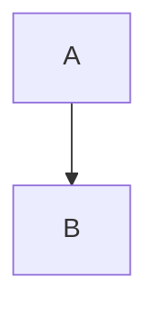

# AGENTS.md — zenn-docs 執筆ガイド

このリポジトリは [Zenn CLI](https://zenn.dev/zenn/articles/zenn-cli-guide) で管理する記事群です。エージェントが記事を新規作成・編集するときは、本ドキュメントと [ZennのMarkdown記法一覧](https://zenn.dev/zenn/articles/markdown-guide) に従ってください。

## リポジトリ構成

| パス | 用途 |
| ---- | ---- |
| `articles/*.md` | 公開・下書き記事（**1ファイル = 1記事**） |
| `images/` | GitHub 連携でデプロイする画像（リポジトリ直下） |
| `books/` | 本を管理する場合（本リポジトリでは未使用でも可） |

初回セットアップ: `articles` が無い場合は `npx zenn init`。CLI の導入手順は [Zenn CLI ガイド](https://zenn.dev/zenn/articles/zenn-cli-guide) 冒頭を参照。

### Zenn CLI（記事）

| 操作 | コマンド |
| ---- | -------- |
| 記事の新規作成 | `npx zenn new:article` |
| Front Matter を指定して作成 | `npx zenn new:article --slug 記事のスラッグ --title タイトル --type idea --emoji ✨` |
| プレビュー | `npx zenn preview`（デフォルト `http://localhost:8000`） |
| ポート指定 | `npx zenn preview --port 3000` |
| 監視・自動リロード OFF | `npx zenn preview --no-watch` |

- 生成されるパスは `articles/<slug>.md`。**slug は記事の一意 ID**（URL 等に使われる）。既存ファイル名は変更しない。
- カスタム `--slug` を付ける場合: `a-z0-9`・ハイフン `-`・アンダースコア `_` の **12〜50 文字**（[CLI ガイド](https://zenn.dev/zenn/articles/zenn-cli-guide)）。
- CLI が生成するランダム slug（例: `66e754792c0d09.md`）もそのまま利用してよい。

### 公開・デプロイ（GitHub 連携）

1. Front Matter で `published: true`（下書きは `false`）。
2. 変更をコミットし、Zenn と連携したリポジトリの**登録ブランチ**へプッシュ → 同期（デプロイ）開始。
3. デプロイ状況・エラーは Zenn ダッシュボードのデプロイ履歴で確認。
4. 反映まで時間がかかることがある。未ログイン時はキャッシュで古い内容が見える場合あり。

**公開予約・公開日時**

```yaml
published: true
published_at: 2050-06-12 09:03   # YYYY-MM-DD または YYYY-MM-DD hh:mm（JST）
```

- 未来の `published_at` → 公開予約。過去の日時 → 移行記事などで表示上の公開日を指定（**一度設定した公開日時は変更不可**）。
- 日付のみの場合は時刻 `00:00`。

**その他**

- コミットメッセージに `[ci skip]` または `[skip ci]` があると **Zenn のデプロイはスキップ**される。
- 記事更新は同じ slug の `.md` を編集してプッシュ。slug が変わると**別記事**として扱われる。
- `articles/` からファイルを削除しても **zenn.dev 上の記事は削除されない**（削除はダッシュボードから）。

### 本（book）を追加する場合

`npx zenn new:book` で `books/<本slug>/`（`config.yaml`・`cover.png`・チャプター `.md`）を作成。プレビューは同じ `npx zenn preview`。詳細は [CLI ガイド（本）](https://zenn.dev/zenn/articles/zenn-cli-guide#cli-で本bookを管理する)。

## 記事ファイル（Frontmatter）

各記事は YAML frontmatter で始めます。新規記事は CLI の `zenn new:article` で生成するか、既存ファイルの形式に合わせます。

```yaml
---
title: "記事タイトル"
emoji: "📝"
type: "tech"   # tech | idea
topics:
  - "トピック1"
published: false
---
```

- `title`: 空のままにしない（公開前に必ず埋める）。
- `emoji`: Zenn 一覧用の絵文字（1つ）。
- `type`: 技術記事は `tech`、アイデア・所感は `idea`。
- `topics`: 検索・分類用。3〜5個程度が目安。
- `published`: `false` で下書き。エージェントはユーザー指示がない限り `true` にしない。
- `published_at`: 公開・予約・表示上の公開日（JST）。形式は `YYYY-MM-DD` または `YYYY-MM-DD hh:mm`。

本文のファイル名（例: `articles/66e754792c0d09.md`）は slug 兼ファイル名。**更新時も rename しない**。

## 記事構成（推奨テンプレート）

[Zenn記事の書き方｜構成テンプレと手順](https://zenn.dev/kakeru_tools/articles/zenn-kiji-kakikata) に沿い、**書き始める前に見出しだけ先に並べる**。

1. **課題** — 何に困っていて、この記事で何が解決するか（1〜2文。背景の長い前置きから入らない）。
2. **前提** — OS・ランタイム・主要ライブラリのバージョン、想定読者（箇条書き）。
3. **手順** — 再現できるステップ。各ステップは見出し + コマンド／コード。
4. **ハマりどころ** — エラー原文、原因の一言、回避策（差別化ポイント）。
5. **まとめ** — 要点 2〜3 点と次の一歩・関連リンク。

検索流入の読み方（困る → 再現確認 → 注意点）とこの順序は一致させる。

## 本文の執筆ルール

- **見出し**: アクセシビリティのため本文は **`##`（見出し2）から**始める。`#` は Zenn 上で記事タイトルが担うため本文では使わない。
- **段落**: 3〜4文ごとに空行で段落を分ける（スマホ可読性）。
- **コードブロック**: 必ず言語を指定する。配置先が分かるよう `言語:ファイル名` 形式を推奨（例: ` ```ts:app/page.tsx` ）。
- **注意喚起**: Zenn 独自のメッセージ記法を使う（下記）。
- **画像**: リポジトリ管理なら `/images/` ルールに従う（下記）。スクリーンショットより、可能ならコードや図で示す（陳腐化しにくい）。
- **下書き**: 見出し skeleton を先に置き、各ブロックを後から埋める。

## Zenn Markdown 記法（エージェント向け要約）

詳細は [公式 Markdown ガイド](https://zenn.dev/zenn/articles/markdown-guide) を参照。

### 基本

- リスト: `-` または `*`。番号付きは `1.` 形式。
- リンク: `[テキスト](URL)`。
- 引用: `>`。
- 脚注: `[^1]` と `[^1]: 内容`。インライン脚注 `^[内容]` も可。
- 区切り線: `-----`。
- 強調: `*斜体*` `**太字**` `~~打ち消し~~`、インライン `` `code` ``。
- 改行: Enter で改行（markdown-it の breaks 相当）。表内改行は `<br>`。
- HTML: 公開ページでは **`<!-- 単行コメント -->` と `<br>` のみ**が実用的に使える想定（その他タグは非対応）。

### 画像

**GitHub リポジトリ連携でホストする場合**（[公式ガイド](https://zenn.dev/zenn/articles/deploy-github-images)）

- 配置: リポジトリ直下の **`images/`**（サブディレクトリ自由。例: `images/my-article/diagram.png`）。
- 制限: **3MB 以内**、拡張子 `.png` `.jpg` `.jpeg` `.gif` `.webp` のみ（違反時デプロイエラー）。
- 参照: 埋め込み URL は **`/images/` から始める絶対パス**（相対パス不可）。

```markdown


```

```markdown
# 誤り（プレビュー・本番で表示されない）


```

- プレビューで表示確認（zenn-cli **0.1.93 以降**）。zenn.dev のオンラインエディタだけではリポジトリ画像のプレビュー不可。
- 画像を GitHub から削除すると Zenn 上も削除される。記事から参照中のファイルは消さない。
- 差し替え後、最大約 1 分古い画像が見えることがある。

**その他の画像**

- Zenn 画像アップロード（要ログイン）の URL、外部 URL（Gyazo 等）も利用可（[CLI ガイド](https://zenn.dev/zenn/articles/zenn-cli-guide)）。

**Markdown 記法（共通）**

```markdown


*キャプション*
[](リンクURL)
```

透過 PNG はライト背景前提の表示になる場合がある（ダークテーマとの兼ね合いに注意）。

### テーブル

標準的な GitHub 風パイプ表。

### コードブロック

````markdown
```js
const x = 1;
```

```js:filename.js
const x = 1;
```

```diff js:filename.js
- old
+ new
```

```text
プレーンテキスト（ファイル名のみ表示したい場合）
```
````

- シンタックスハイライトは Shiki 系（言語名は [対応言語一覧](https://github.com/shikijs/shiki/blob/main/docs/languages.md) に準拠）。
- `diff` 使用時、行頭が `+` `-` `>` `<` または半角スペースでない行はハイライトされない。

### 数式（KaTeX）

ブロック（前後に空行を入れる）:

```markdown
$$
e^{i\theta} = \cos\theta + i\sin\theta
$$
```

インライン: `$a \ne 0$`

### Zenn 独自記法

**メッセージ**

```markdown
:::message
通常の注意
:::

:::message alert
警告
:::
```

**アコーディオン**

```markdown
:::details タイトル
折りたたみ本文
:::
```

ネストする場合は外側の `:` を増やす（例: `::::details` / `:::message`）。

### 埋め込み

- **リンクカード**: URL だけの行、または `@[card](URL)`。アンダースコア入り URL は `@[card](...)` や `<URL>` を検討。
- **X**: ポスト URL 単独行（`@[tweet](URL)` は特殊 URL 向け）。
- **YouTube**: 動画 URL 単独行。
- **GitHub**: ファイル URL / パーマリンク単独行（`#L1-L3` で行範囲指定可）。テキストファイルのみ。
- その他: `@[gist](URL)` `@[codepen](URL)` `@[speakerdeck](id)` など（公式一覧参照）。

### Mermaid

````markdown

````

制限: クリック無効、**2000 文字/ブロック**、`&` チェーンは **10 以下**。

## エージェントの作業手順

1. 対象が新規か既存かを確認し、frontmatter を欠落させない。新規は `npx zenn new:article` を推奨。
2. 構成テンプレ（課題→前提→手順→ハマりどころ→まとめ）に沿って執筆・追記する。
3. 見出しは `##` から、コードに言語（と可能ならファイル名）を付ける。
4. 画像を追加する場合は `images/` に置き、本文は `` で参照。`npx zenn preview` で表示確認。
5. ユーザーが明示しない限り **`published: true` にしない**（下書きのまま）。公開・予約時のみ `published_at` を設定（JST）。
6. 記事・画像のみ変更し、`node_modules` や無関係ファイルは触らない。デプロイを止めたいコミットに `[ci skip]` を付けない（ユーザーが意図した場合を除く）。
7. コミット・PR の説明は **日本語**、Conventional Commits に従う（ユーザーが依頼した場合のみコミット）。

## 参考リンク

- [Zenn CLIで記事・本を管理する方法](https://zenn.dev/zenn/articles/zenn-cli-guide)
- [GitHubリポジトリ連携で画像をアップロードする方法](https://zenn.dev/zenn/articles/deploy-github-images)
- [ZennのMarkdown記法一覧](https://zenn.dev/zenn/articles/markdown-guide)
- [Zenn記事の書き方｜構成テンプレと手順](https://zenn.dev/kakeru_tools/articles/zenn-kiji-kakikata)
