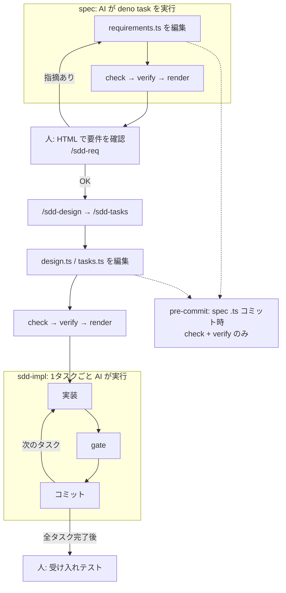

issue を AI に実装させたいのに、Markdown の仕様だと ID の取り違えや対応漏れを AI がそのまま進めてしまう、という経験から、自作の SDD スキル集 [sdd-orc（v2.0.0）](https://github.com/paterapatera/sdd-orc/tree/v2.0.0) を作りました。
**要件・設計・タスクの正本を TypeScript** にし、人が読むのはそこから生成した HTML だけに寄せています。

課題と目指した運用のあと、前提・手順・TypeScript 正本の形・ハマりどころの順でまとめます。
issue の取り込み先 `issue.md` は Markdown のままです。

## 課題

要件・設計・タスクの正本を Markdown にすると、ID の typo やトレーサビリティの漏れを機械的に検証できず、AI が仕様を取り違えたまま実装に進みやすくなります。
本記事では正本を TypeScript に置き、検証スクリプトでその認識ミスを先に落とす sdd-orc の設計と手順を説明します。

最初は「SKILL.md に手順を丁寧に書けば AI も従うだろう」と考えていました。
実際に試すと、**文章だけの決まりは守られにくい** ことがわかってきました。

Markdown の仕様書だと、次のような問題が起きやすかったです。

- FR-001 と AC-003 の **ID の typo** に気づけない
- 設計が FR-002 をカバーしているか **対応表の漏れ** に気づけない
- 「境界値・異常系も書く」というルールが **任意解釈** される
- issue（取り込み先は `issue.md`）の受け入れ条件の箇条書きが **要件に落ちていない** まま進む

人間向けの読みやすさと、機械（と AI）向けの厳密さは、要件・設計・タスクを同じ Markdown で正本にすると両立しにくいと感じました。

## 目指した運用

上記を踏まえ、TypeScript 正本と検証スクリプトで次の運用に寄せました。

- **人が触るのは** 受け入れ条件（AC）の確認、受け入れテスト、設計の確認ポイントへの回答まで
- **マージ前の品質は** フォーマッタ・lint・型・テストの **品質ゲート** で機械的に確認する（人的コードレビューは必須フローにしない）
- **ブランチ上の spec は** issue からブランチを切り、マージ前に `docs/specs/<issue ID>/` をリポジトリから外し、長く残す知識だけ `docs/sdd/` などの恒久ドキュメントへ移す

## 前提

**想定読者**:
Cursor などで Agent Skills（`.agents/skills/`）を試している開発者で、AI に実装を任せつつ要件だけ人が確認したい人です。

- **実行環境**: Deno 2 以上（対象リポジトリに `node_modules` を増やしません）
- **AI ツール**: `.agents/skills/` を読めるもの（Cursor で動作確認済み。Claude Code 専用ではありません）
- **導入後**: 対象プロジェクトに `docs/sdd/` と `docs/specs/<issue ID>/` ができる。スキル本体は [sdd-orc（v2.0.0）](https://github.com/paterapatera/sdd-orc/tree/v2.0.0) をコピーして使う（記事の説明対象は `main` ではなくこのブランチ）

各 SKILL の frontmatter では `disable-model-invocation: true` とし、`/sdd-start` のように **ユーザーが明示的に呼んだときだけ** 動きます。

| スキル | 役割（要約） |
| --- | --- |
| `sdd-init` | ツールの導入・更新、恒久ドキュメント（品質ツールは別スキル `propose-quality-tools` を `/sdd-init` から利用） |
| `sdd-start` | issue 取り込み、モード判定、ブランチ作成 |
| `sdd-req` / `sdd-design` / `sdd-tasks` | 完全モードの requirements / design / tasks |
| `sdd-quick` | 軽量モードの `spec.ts` |
| `sdd-impl` | 1タスク1コミットで品質ゲートを通しながら実装 |
| `sdd-finish` | 恒久ドキュメント反映、spec 削除、PR 作成 |

完全モードでは **要件だけ HTML で人に見せ**、設計・タスクの本文は AI が書きます。
要件から決められない設計上の選択だけ、確認ポイントで人が答えます。

## 手順（完全モードの流れ）

[sdd-orc の README（v2.0.0）](https://github.com/paterapatera/sdd-orc/blob/v2.0.0/README.md) と同じ流れです。
以降、issue ID の例として **EX-001** を使います（自分の ID に読み替えてください）。

**導入**

1. [sdd-orc（v2.0.0）](https://github.com/paterapatera/sdd-orc/tree/v2.0.0) の `.agents/skills/` を対象リポジトリへコピーします
2. 対象リポジトリのルートで `/sdd-init` を実行し、`docs/sdd/` と pre-commit hook を入れます

**1 issue の流れ**

1. **`/sdd-start`** — issue を `docs/specs/EX-001/issue.md` に取り込み、`feature/ex-001-<slug>` ブランチを作ります（ID は小文字）
2. **`/sdd-req`** — `requirements.ts` を書く → 次のコマンド → **人が `.sdd/out/EX-001/index.html` をブラウザで開き、要件全体を確認**

```sh
deno task --config docs/sdd/deno.json check EX-001
deno task --config docs/sdd/deno.json verify EX-001
deno task --config docs/sdd/deno.json render EX-001
```

3. **`/sdd-design`** — `design.ts`（分岐があれば確認ポイントで質問）。コミット時も pre-commit が `check` / `verify` を走らせます
4. **`/sdd-tasks`** — `tasks.ts`（人の確認なし。同様に `check` / `verify`）
5. **`/sdd-impl`** — 1タスク1コミット、`gate` で実装の品質ゲート → **人が受け入れテスト**
6. **`/sdd-finish`** — 恒久ドキュメントへ反映、spec 削除、PR/MR 作成 → squash マージ

軽量モードは `spec.ts` 1ファイルにまとめ、`/sdd-quick` で spec を書いたあと **人が HTML で期待動作と受け入れ条件を確認** し、同じ `check` / `verify` / `render` を使います。

## 成果物を TypeScript にした理由

### spec は AI だけが読み、人は HTML を読む

正本は次のような配置です（作業ブランチ内だけ。main には spec を入れません）。

```text
docs/specs/EX-001/
├── issue.md          # Markdown（issue 取り込み）
├── requirements.ts   # 完全モード
├── design.ts
├── tasks.ts
└── spec.ts           # 軽量モード（完全モードと同居しない）

.sdd/out/EX-001/index.html   # 人向け（gitignore）。render の出力先
```

要件を人に確認してもらう前に、スキル（例: `/sdd-req`）の手順どおり AI が `check` / `verify` / `render` を実行し、`.sdd/out/EX-001/index.html` を更新します。
人はその HTML をブラウザで開き、要件全体を確認します。
不備があればチャットで指摘します。

Markdown を「人と AI の共用フォーマット」にしないことで、TypeScript 側は **データと ID と参照** に寄せられます。

### なぜ JSON Schema ではなく TypeScript か

要件の形を JSON で固定する方法もあります。
今回 TypeScript にしたのは、主に次の2点です。

- **requirements.ts・design.ts・tasks.ts をまたいだ参照** — 存在しない要件 ID やコンポーネント名を tasks が書けないように、コンパイル時に落とせます
- **spec の型チェック・整合性検証・HTML 生成** — Deno だけで動くツールを、spec と同じ言語に揃えられます

アプリ本体が Python でも PHP でも、spec DSL のホストとして TS を選んでいます。

### 型で「形」と「参照」を先に縛る

型定義の方針は「**ID・参照・必須項目・列挙値だけ型で守り、説明文は string のまま**」です。
AI が長文を書く部分は自由度を残しつつ、抜け漏れしやすい骨格をコンパイル時に落とします。

例: 機能要件 ID は `FR-001` 形式のリテラル型に縛り、`defineRequirements` 経由で定義します（以下は抜粋）。

```ts:docs/specs/EX-001/requirements.ts
import { defineRequirements } from "../../sdd/schema/mod.ts";

export default defineRequirements({
  issue: "EX-001",
  summary: "ログイン失敗回数に応じてアカウントをロックする。",
  functional: {
    "FR-001": {
      title: "失敗回数によるロック",
      ears: {
        pattern: "event",
        trigger: "同じアカウントでログインに5回続けて失敗した",
        response: "そのアカウントを15分間ロックしなければならない",
      },
      acceptance: [
        {
          id: "AC-001",
          kind: "boundary",
          verifiedBy: "human",
          given: ["アカウントAのログイン失敗回数が4回である"],
          when: "アカウントAで誤ったパスワードでログインする",
          then: ["アカウントAがロックされる"],
        },
      ],
    },
  },
  // ...
});
```

EARS（要件記法）も **判別共用体** にしており、`pattern: "event"` なのに `trigger` が無い、といったミスは型チェックで落ちます。
HTML では型のコメントどおり日本語文に組み立てるので、**EARS 文が自然な日本語として読めるか** を人が HTML 上で確認します（`verify` が文体まで機械判定するわけではありません）。

`requirements.ts` には機能要件以外にも、**決まった数の欄をすべて埋めないとコンパイルできない** 項目があります。
たとえば次のとおりです。

- **非機能要件の検討** — IPA の6カテゴリ（可用性・性能など）それぞれについて、見送り理由か追加した要件 ID を書きます
- **十分性チェックリスト** — 利用者・境界値・対象外など、手引きで決めた観点を1つずつ「検討した／関係ない」と記録します

Markdown の表なら行の取りこぼしが diff で見えにくいですが、**欄の数が型で固定** されているので、欠けた時点で `deno task check` が落ちます。

### ファイルをまたいだ対応を型エラーにする

設計・タスクは、要件の型を **import type だけ** で受け取ります（抜粋）。

```ts:docs/specs/EX-001/tasks.ts
import { defineTasks } from "../../sdd/schema/mod.ts";
import type requirements from "./requirements.ts";
import type design from "./design.ts";

export default defineTasks<typeof requirements, typeof design>()({
  tasks: {
    "T-001": {
      title: "LockoutPolicy の追加",
      kind: "impl",
      refs: ["FR-001", "LockoutPolicy"],
      status: "todo",
      description: "...",
    },
  },
});
```

存在しない `FR-999` や、存在しないコンポーネント名を `refs` に書くと **コンパイルエラー** になります。
Markdown のトレーサビリティ表より、AI が編集しやすい単一の真実源になりました。

### 型では足りないところを `verify` が補う

`deno task check` は **TypeScript の型** だけを見ます。
`deno task verify` は **spec の中身がルールどおりか** を見ます。
型では縛れませんが、AI が飛ばしやすい点をここで落とします。

たとえば `verify` が確かめるのは次のようなものです。

- 要件の書き方 — EARS の文末が「〜しなければならない」になっているか
- issue との対応 — `issue.md` に書いた受け入れ条件が、要件側に漏れなく反映されているか
- タスクとの対応 — 人が画面で確かめる受け入れ条件に、テストや E2E のタスクが紐づいているか

一方、**実装したソースコード** のフォーマット・lint・テストは **`gate`** が担当します（プロジェクトごとに `docs/sdd/config.ts` でコマンドを定義します）。
spec を直す段階では `verify`、コードを書く段階では `gate`、と役割が分かれています。

次の図は、**deno task の分担**と、**人が HTML を見るタイミング**（v2.0.0・完全モード）の整理です。
コマンドは AI が実行し、人は要件の HTML 確認と、実装完了後の受け入れテストを行います。
（受け入れ直前の `gate --full` や `acceptance` 準備などは図では省略しています。）



```sh
deno task --config docs/sdd/deno.json check EX-001
deno task --config docs/sdd/deno.json verify EX-001
deno task --config docs/sdd/deno.json render EX-001
```

`sdd-req` の SKILL でも、書いたあと **check → verify → render** までを手順に組み込んでいます。
AI に「守ってね」と書くより、**コマンドが失敗したら先に進めない** 方が効きます。

### pre-commit で spec のコミットを止める

コミットに **ステージされたファイル名** のうち `docs/specs/` または `docs/sdd/` 配下の `.ts` があるときだけ、hook が `check` と `verify` を実行します。
SDD を使わないメンバーの通常コミットには触れません。
実装だけのコミットでは spec 用 hook は動きません。

```sh:docs/sdd/scripts/pre-commit.sh
files=$(git diff --cached --name-only --diff-filter=ACMR | grep -E '^docs/(specs|sdd)/.*\.ts$')
[ -z "$files" ] && exit 0
# ...
deno task --quiet --config "$config" check $issues || exit 1
deno task --quiet --config "$config" verify $issues || exit 1
```

:::message alert
pre-commit が見るのは **作業ツリー上のファイル** であり、ステージ内容そのものではありません（hook 内コメントのとおり）。
`docs/sdd/` が変わったコミットでは **すべての issue** を検査します。
ステージと作業ツリーがずれていると、意図と違う結果になるので注意してください。
:::

### Deno にした理由（対象リポジトリを選ばない）

SDD 用のツールを載せる土台として、Deno は **まるで仕様駆動開発のために用意されたランタイム** のように使いやすいです。
TypeScript の spec をそのまま `deno check` で型検査し、検証・HTML 生成も **1つの `deno run` / `deno task`** で回せます。
しかも対象リポジトリには **`node_modules` も lock も import map も増やしません**（`docs/sdd/deno.json` だけで完結します）。

:::message
アプリ本体が Python / PHP / Rust でも、SDD ツールは同じ `.agents/skills/` と `docs/sdd/` をコピーするだけです。
実装言語と spec のホスト（TypeScript + Deno）を分離できます。
Deno を入れるのは **SDD を使う人のマシン** で足り、プロダクトの依存関係には触れません。
:::

## ハマりどころ

### Markdown 仕様から移行する想像とのギャップ

TypeScript にすると「人向けの仕様が読みにくくなるのでは」と心配されがちです。
実際、**Markdown の仕様であっても読みづらかった** という経験の方が強かったです。
長い md を diff で追うのを面倒くさがり、流し読みで承認してしまい、**コードレビューや動作確認の段階で初めて仕様への指摘が出る** ことが頻繁に起きていました。

だからこそ、人は `.ts` ではなく **HTML だけを読む** 前提に切り替えました。
章立て（機能要件・受け入れ条件・未確定の点）を要件確定のタイミングで確認し、後工程に指摘を持ち越さない方が運用しやすかったです。

### 型を増やしすぎない

最初は「文章の品質も型で」とやりたくなりますが、結局 AI が言い回しを変えるだけで、型が壊れます。
**ID と参照と列挙** に絞り、文体や EARS の終わり方は `verify` に任せる、という分担がちょうどよかったです。

### スキルの文章も依然として必要

TypeScript にしても SKILL.md は要ります。
ただし役割が変わり、「細かい整合性チェックのリスト」から **いつ止まって人に聞くか（確認ポイント）** と **どのコマンドをいつ打つか** に集中できます。
試行で学んだのは、**確認ポイント以外では止まらない** と明記しないと、スキル呼び出しを承認と勘違いされる、という点です。

### spec は main に残さない

この記事で **いちばんこだわった方針のひとつ** が、「作業中の spec を main に残さない」ことです。

ブランチ上の TypeScript は **その issue の作業用バッファ** です。
マージ前に `docs/specs/<issue>/` ごと削除し、main に残すのは ADR や `docs/sdd/architecture.ts` など **恒久ドキュメントだけ** にします。
そうしないと、実装済みの古い要件・設計がリポジトリに残り、**コードと spec のどちらが正か分からなくなります**（二重の真実源になります）。

知識は `sdd-finish` で恒久側へ要約して移します。
issue ごとの細部は PR と履歴に任せ、main は「今の製品の説明」に絞る、という割り切りです。

## まとめ

- **課題**: AI に実装を任せるとき、Markdown + 長いルール文だけでは整合性が保ちにくいです
- **方針**: 要件・設計・タスクの正本は TypeScript、人は HTML、整合性は `deno task --config docs/sdd/deno.json check`（型）と `verify`（spec）、実装は `gate` です
- **効いた点**: ID typo・要件と設計・タスクの対応漏れ・issue 受け入れ条件の未反映など、AI の仕様認識ミスを人の目視より先に機械で落とせます

同じことを Markdown で続けていた頃と比べ、**「AI が読む仕様」と「人が判断する要件」** の分離がはっきりしたのがいちばんの収穫です。

同じ悩みを持っている方に、[sdd-orc の v2.0.0 ブランチ](https://github.com/paterapatera/sdd-orc/tree/v2.0.0) をぜひ使ってみてほしいです。
`.agents/skills/` をコピーし、`/sdd-init` から試せます。

:::message alert
この記事の内容は **v2.0.0 ブランチ** 上の sdd-orc を前提にしています。
GitHub の既定表示は `main` のため、README やスキルを読むときはブランチを **v2.0.0** に切り替えるか、上のリンクから開いてください。
:::

@[card](https://github.com/paterapatera/sdd-orc/tree/v2.0.0)
