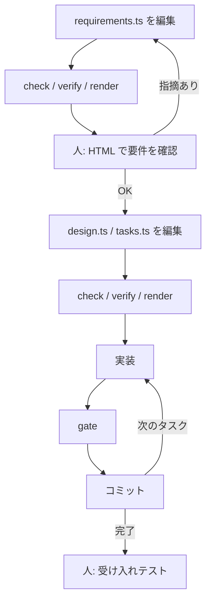

SDDでAI開発したいのに、Markdownの仕様だと、IDの取り違えや対応漏れをAIがそのまま進めてしまう、という経験から、自作のSDDスキル集 [sdd-orc（v2.0.0）](https://github.com/paterapatera/sdd-orc/tree/v2.0.0) を作りました。
要件・設計・タスクの正本をTypeScriptにし、人が読むのはそこから生成したHTMLだけに寄せています。

課題と目指した運用のあと、他のSDDとの比較、前提・TypeScriptの仕様の形・ハマりどころの順でまとめます。

## 課題

要件・設計・タスクの正本をMarkdownにすると、IDのつけ忘れやトレーサビリティの漏れを機械的に検証できません。
そのため、AIが仕様を取り違えたまま実装に進みやすくなります。
仕様をTypeScriptに置き、検証スクリプトでその認識ミスを先に落とすSDD手法の設計を説明します。

SDDを使い始めた頃は「SKILL.mdに手順を丁寧に書けばAIも従うだろう」と考えていました。
ですが、実際に試すと、**文章だけの決まりは守られにくい**ことがわかってきました。

Markdownの仕様書だと、次のような問題が起きやすかったです。

- `FR-001`と`AC-001`のIDのtypoに気づけない
- 設計が`FR-002`をカバーしているか、対応表の漏れに気づけない
- 「境界値・異常系も書く」というルールが任意解釈される
- issueの受け入れ条件の箇条書きが要件に落ちていないまま進む

要件・設計・タスクをMarkdownにすると、人間向けの読みやすさと、AI向けの厳密さは両立しにくいと感じました。

## 目指した運用

上記を踏まえ、TypeScript正本と検証スクリプトで次の運用に寄せました。

- 人が確認するのは、受け入れ条件の確認、受け入れテスト、設計の確認ポイントへの回答
- マージ前の品質は、フォーマッタ・lint・型・テストの品質ゲートで機械的に確認する（人的コードレビューは必須フローにしない）
- ブランチ上のspecは、issueからブランチを切り、マージ前に`docs/specs/<issue ID>/`をリポジトリから外し、長く残す知識だけ`docs/sdd/`などの恒久ドキュメントへ移す

## 他のSDDとの比較

実際にTypeScriptにすることで、どれぐらい良くなったかをAIに評価してもらいました。
次の図は cc-sdd、OpenSpec、sdd-orc、Spec Kit を8つの観点で並べたものです。

sdd-orc は「仕様の機械検査」「実装品質の強制」「人の関与の明確さ」「スコープ制御」が他のSDDより優れています。
「仕様の永続性」が低いのは、仕様をイシューと PR と恒久ドキュメントで管理するようにしていて、ファイルとしては残らないからです。
「導入の軽さ」や「他エージェント移植」が低いのは、npx でインストールできなかったり、`.claude` が対象ではなかったりするためです。


*他のSDDとの比較*

- 仕様の機械検査：欠落やトレース切れがコマンド失敗になるか
- 実装品質の強制：format、lint、型、テストを決まった出入口で失敗停止できるか
- 人の関与の明確さ：人が答える地点と、エージェントが進む地点が分かれているか
- スコープ制御：宣言範囲の外の差分を失敗として検出できるか
- 仕様の永続性：マージ後も要件・設計・タスクをファイルで開けるか
- 長期利用：古い受け入れ条件が、今の仕様と並んで残らないか
- 導入の軽さ：専用ランタイムや最初の手順がどれだけ要るか
- 他エージェント移植：同じフェーズ順を Cursor 以外へ渡す前提がファイルにあるか

## スキルの前提

- 実行環境：Deno 2以上
- AIツール：`.agents/skills/`を読めるもの（Cursorで動作確認）

Deno が要るのは、仕様の正本が TypeScript だからです。
対象リポジトリに `node_modules` や lock は足さず、`docs/sdd/deno.json` だけで完結します。

各SKILLは、`/sdd-start`のようにユーザーが明示的に呼んだときだけ動きます。

| スキル | 役割（要約） |
| --- | --- |
| `sdd-init` | ツールの導入・更新、恒久ドキュメント（品質ツールは別スキル`propose-quality-tools`を`/sdd-init`から利用） |
| `sdd-start` | issue取り込み、モード判定、ブランチ作成 |
| `sdd-req` / `sdd-design` / `sdd-tasks` | 完全モードの requirements / design / tasks 生成 |
| `sdd-quick` | 軽量モードの `spec.ts` 生成 |
| `sdd-impl` | 1タスク1コミットで品質ゲートを通しながら実装 |
| `sdd-finish` | 恒久ドキュメント反映、spec削除、PR作成 |

完全モードでは、人と確認を取りながら要件を進め、設計・タスクはAIが自動で進めます。
要件から決められない設計上の選択がある時だけ、確認ポイントで人が答えられるようにしています。

## 成果物をTypeScriptにした理由

今回TypeScriptにした理由は、主に次の3点です。

- requirements.ts・design.ts・tasks.tsをまたいだ参照：存在しない要件IDやコンポーネント名をtasksに書けないように、コンパイル時に落とせます
- specの型チェック・整合性検証・HTML生成：型チェックできるツールを簡単に導入でき、チェックと生成を同じ言語に揃えられます
- Markdownを「人とAIの共用フォーマット」にしないことで、TypeScript側はデータと ID と参照に寄せられます

アプリ本体がPythonでもPHPでも、spec DSLのホストとしてTSを選んでいます。

specは次のような配置です。

```text
docs/specs/EX-001/
├── issue.md          # Markdown（issue 取り込み）
├── requirements.ts   # 完全モード
├── design.ts
├── tasks.ts
└── spec.ts           # 軽量モード（完全モードと同居しない）

.sdd/out/EX-001/index.html   # 人向け（gitignore）。render の出力先
```

### 型で「形」と「参照」を先に縛る

型定義の方針は、「**ID・参照・必須項目・列挙値だけ型で守り、説明文はstringのまま**」です。
AIが長文を書く部分は自由度を残しつつ、抜け漏れしやすい骨格をコンパイル時に落とします。

例: 機能要件IDは`FR-001`形式のリテラル型に縛り、`defineRequirements` 経由で定義します（以下は抜粋）。

```ts:docs/specs/EX-001/requirements.ts
import { defineRequirements } from "../../sdd/schema/mod.ts";

export default defineRequirements({
  issue: "EX-001",
  summary: "ログイン失敗回数に応じてアカウントをロックする。",
  functional: {
    "FR-001": {
      title: "失敗回数によるロック",
      ears: {
        pattern: "event",
        trigger: "同じアカウントでログインに5回続けて失敗した",
        response: "そのアカウントを15分間ロックしなければならない",
      },
      acceptance: [
        {
          id: "AC-001",
          kind: "boundary",
          verifiedBy: "human",
          given: ["アカウントAのログイン失敗回数が4回である"],
          when: "アカウントAで誤ったパスワードでログインする",
          then: ["アカウントAがロックされる"],
        },
      ],
    },
  },
  // ...
});
```

EARS（要件記法）も判別共用体にしており、`pattern: "event"`なのに`trigger`が無い、といったミスは型チェックで落ちます。
HTMLでは型のコメントどおり日本語文に組み立てるので、EARS文が自然な日本語として読めるかは人がHTML上で確認します。

`requirements.ts`には機能要件以外にも、決まった数の欄をすべて埋めないとコンパイルできない項目があります。
たとえば次のとおりです。

- 非機能要件の検討：IPAの6カテゴリ（可用性・性能など）それぞれについて、見送り理由か追加した要件IDを書きます
- 十分性チェックリスト：利用者・境界値・対象外など、手引きで決めた観点を1つずつ「検討した／関係ない」と記録します

Markdownの表なら行の取りこぼしがdiffで見えにくいですが、欄の数が型で固定されているので、欠けた時点で`deno task check`が落ちます。

### ファイルをまたいだ対応を型エラーにする

`design.ts` と `tasks.ts` は、`requirements.ts` の型を import type だけで受け取ります。
タスクの `refs` に存在しない `FR-999` や、設計に無いコンポーネント名を書くとコンパイルエラーになります。
Markdown のトレーサビリティ表より、AI が編集しやすい単一の参照元になりました。

### 型では足りないところを`verify`が補う

`deno task check`は TypeScript の型だけを見ます。
`deno task verify`は spec の中身がルールどおりかを見ます。
型では縛れませんが、AIが飛ばしやすい点を`verify`で落とします。

たとえば `verify` が確かめるのは次のようなものです。

- 要件の書き方：EARSの文末が「〜しなければならない」になっているか
- issueとの対応：`issue.md`に書いた受け入れ条件が、要件側に漏れなく反映されているか
- タスクとの対応：人が画面で確かめる受け入れ条件に、テストやE2Eのタスクが紐づいているか

一方、実装したソースコードのフォーマット・lint・テストは `gate` が担当します（プロジェクトごとに `docs/sdd/config.ts` でコマンドを定義します）。
specを直す段階では`verify`、コードを書く段階では`gate`、と役割が分かれています。

次の図は、deno taskの分担と、人がHTMLを見るタイミング（完全モード）の整理です。
コマンドはAIが実行し、人は要件のHTML確認と、実装完了後の受け入れテストを行います。
（受け入れ直前の`gate --full`や`acceptance`準備などは図では省略しています。）



## 作っている時に考えたこと

### 説明文まで型にすると、言い回しだけで型チェックが落ちる

文章の品質まで型にすると、AI が言い回しを変えただけで型チェックが落ちます。
原因は、説明文をリテラル型で縛っていることです。
ID・参照・列挙だけを型にし、EARS の文末は `verify` に任せます。

### Markdownなら人でも読めるのに、わざわざTypescriptとHTMLに分ける必要があるのか

実際にSDDを使った開発をして経験したことは、Markdownだったとしても、長い文章は流し読みして、承認を出す傾向にありました。
そして、実装後のコードレビューや受け入れテストの段階で、仕様の指摘をすることが多かったです。
最終的にはMarkdownであっても、HTMLを作成して確認するやり方に落ち着きました。

それなら、最初からAIが読みやすい資料と人が読みやすい資料を分けて考えたほうが良いという発想になりました。

## まとめ

- 仕様の抜けは、型と `verify` で人の目視より先に落とす
- 人が止めるのは、HTML での要件確認と、実装後の受け入れテスト

試すときは [sdd-orc の v2.0.0 ブランチ](https://github.com/paterapatera/sdd-orc/tree/v2.0.0) の `.agents/skills/` をコピーし、`/sdd-init` から始めてください。

:::message alert
この記事の内容は **v2.0.0 ブランチ** 上のsdd-orcを前提にしています。
GitHubの既定表示は`main`のため、READMEやスキルを読むときはブランチを **v2.0.0** に切り替えるか、上のリンクから開いてください。
:::

@[card](https://github.com/paterapatera/sdd-orc/tree/v2.0.0)
