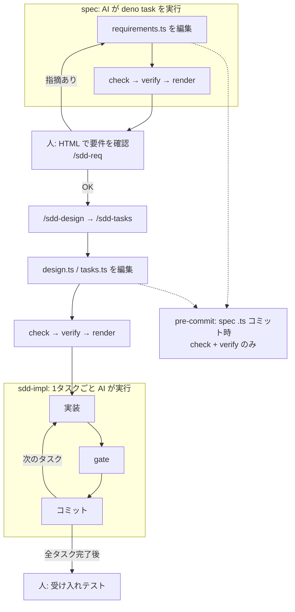

SDDでAI開発したいのに、Markdownの仕様だとIDの取り違えや対応漏れをAIがそのまま進めてしまう、という経験から、自作のSDDスキル集 [sdd-orc（v2.0.0）](https://github.com/paterapatera/sdd-orc/tree/v2.0.0) を作りました。
**要件・設計・タスクの正本をTypeScript** にし、人が読むのはそこから生成したHTMLだけに寄せています。

課題と目指した運用のあと、前提・手順・TypeScriptの仕様の形・ハマりどころの順でまとめます。

## 課題

要件・設計・タスクの正本をMarkdownにすると、IDのつけ忘れやトレーサビリティの漏れを機械的に検証できず、AIが仕様を取り違えたまま実装に進みやすくなります。
本記事では仕様をTypeScriptに置き、検証スクリプトでその認識ミスを先に落とすSDD手法の設計と手順を説明します。

SDDを使い始めた頃は「SKILL.mdに手順を丁寧に書けばAIも従うだろう」と考えていました。
ですが、実際に試すと、**文章だけの決まりは守られにくい** ことがわかってきました。

Markdownの仕様書だと、次のような問題が起きやすかったです。

- `FR-001`と`AC-001`の **IDのtypo** に気づけない
- 設計が`FR-002`をカバーしているか **対応表の漏れ** に気づけない
- 「境界値・異常系も書く」というルールが **任意解釈** される
- issueの受け入れ条件の箇条書きが **要件に落ちていない** まま進む

人間向けの読みやすさと、AI向けの厳密さは、要件・設計・タスクをMarkdownにすると両立しにくいと感じました。

## 目指した運用

上記を踏まえ、TypeScript正本と検証スクリプトで次の運用に寄せました。

- **人が確認するのは** 受け入れ条件の確認、受け入れテスト、設計の確認ポイントへの回答
- **マージ前の品質は** フォーマッタ・lint・型・テストの **品質ゲート** で機械的に確認する（人的コードレビューは必須フローにしない）
- **ブランチ上のspecは** issueからブランチを切り、マージ前に`docs/specs/<issue ID>/`をリポジトリから外し、長く残す知識だけ`docs/sdd/`などの恒久ドキュメントへ移す

## 前提

**想定読者**: AIに実装を任せつつ要件だけ人が確認したい人。

- **実行環境**: Deno 2以上
- **AIツール**: `.agents/skills/`を読めるもの（Cursorで動作確認）

各SKILLは、`/sdd-start`のように **ユーザーが明示的に呼んだときだけ** 動きます。

| スキル | 役割（要約） |
| --- | --- |
| `sdd-init` | ツールの導入・更新、恒久ドキュメント（品質ツールは別スキル`propose-quality-tools`を`/sdd-init`から利用） |
| `sdd-start` | issue取り込み、モード判定、ブランチ作成 |
| `sdd-req` / `sdd-design` / `sdd-tasks` | 完全モードの requirements / design / tasks 生成|
| `sdd-quick` | 軽量モードの `spec.ts` 生成|
| `sdd-impl` | 1タスク1コミットで品質ゲートを通しながら実装 |
| `sdd-finish` | 恒久ドキュメント反映、spec削除、PR作成 |

完全モードでは **要件を人と確認を取りながら進め**、設計・タスクはAIが自動で進めます。
要件から決められない設計上の選択がある時だけ、確認ポイントで人が答えられるようにしてます。

## 手順（完全モードの流れ）

issue IDの例として **EX-001** を使います。

**導入**

1. [sdd-orc（v2.0.0）](https://github.com/paterapatera/sdd-orc/tree/v2.0.0)の`.agents/skills/`を対象リポジトリへコピーします
2. 対象リポジトリのルートで`/sdd-init`を実行し、`docs/sdd/`と`pre-commit hook`を入れます

**1 issueの流れ**

1. **`/sdd-start`** — issueを`docs/specs/EX-001/issue.md`に取り込み、`feature/ex-001-<slug>`ブランチを作ります
2. **`/sdd-req`** — `requirements.ts`を書く → 下記のチェックとHTML生成コマンドを実行 → **人がHTMLをブラウザで開き、要件全体を確認**

```sh
deno task --config docs/sdd/deno.json check EX-001
deno task --config docs/sdd/deno.json verify EX-001
deno task --config docs/sdd/deno.json render EX-001
```

3. **`/sdd-design`** — `design.ts`。コミット時もpre-commitが `check` / `verify` を走らせます
4. **`/sdd-tasks`** — `tasks.ts`（同様に `check` / `verify`）
5. **`/sdd-impl`** — 1タスク1コミット、`gate`で実装の品質ゲート → **人が最終テスト**
6. **`/sdd-finish`** — 恒久ドキュメントへ反映、spec削除、PR作成 → マージ

軽量モードは `spec.ts` 1ファイルにまとめ、`/sdd-quick`でspecを書いたあと **人がHTMLで期待動作と受け入れ条件を確認** し、同じ `check` / `verify` / `render` を使います。

## 成果物をTypeScriptにした理由

今回TypeScriptにした理由は、主に次の3点です。

- **requirements.ts・design.ts・tasks.tsをまたいだ参照** — 存在しない要件IDやコンポーネント名をtasksが書けないように、コンパイル時に落とせます
- **specの型チェック・整合性検証・HTML生成** — 型チェックできるツールを簡単に導入でき、チェックと生成を同じ言語に揃えられます
- Markdownを「人とAIの共用フォーマット」にしないことで、TypeScript側は **データと ID と参照** に寄せられる

アプリ本体がPythonでもPHPでも、spec DSLのホストとしてTSを選んでいます。

specは次のような配置です。

```text
docs/specs/EX-001/
├── issue.md          # Markdown（issue 取り込み）
├── requirements.ts   # 完全モード
├── design.ts
├── tasks.ts
└── spec.ts           # 軽量モード（完全モードと同居しない）

.sdd/out/EX-001/index.html   # 人向け（gitignore）。render の出力先
```

### 型で「形」と「参照」を先に縛る

型定義の方針は「**ID・参照・必須項目・列挙値だけ型で守り、説明文はstringのまま**」です。
AIが長文を書く部分は自由度を残しつつ、抜け漏れしやすい骨格をコンパイル時に落とします。

例: 機能要件IDは`FR-001`形式のリテラル型に縛り、`defineRequirements` 経由で定義します（以下は抜粋）。

```ts:docs/specs/EX-001/requirements.ts
import { defineRequirements } from "../../sdd/schema/mod.ts";

export default defineRequirements({
  issue: "EX-001",
  summary: "ログイン失敗回数に応じてアカウントをロックする。",
  functional: {
    "FR-001": {
      title: "失敗回数によるロック",
      ears: {
        pattern: "event",
        trigger: "同じアカウントでログインに5回続けて失敗した",
        response: "そのアカウントを15分間ロックしなければならない",
      },
      acceptance: [
        {
          id: "AC-001",
          kind: "boundary",
          verifiedBy: "human",
          given: ["アカウントAのログイン失敗回数が4回である"],
          when: "アカウントAで誤ったパスワードでログインする",
          then: ["アカウントAがロックされる"],
        },
      ],
    },
  },
  // ...
});
```

EARS（要件記法）も **判別共用体** にしており、`pattern: "event"`なのに`trigger`が無い、といったミスは型チェックで落ちます。
HTMLでは型のコメントどおり日本語文に組み立てるので、**EARS文が自然な日本語として読めるか** は人がHTML上で確認します。

`requirements.ts`には機能要件以外にも、**決まった数の欄をすべて埋めないとコンパイルできない** 項目があります。
たとえば次のとおりです。

- **非機能要件の検討** — IPAの6カテゴリ（可用性・性能など）それぞれについて、見送り理由か追加した要件IDを書きます
- **十分性チェックリスト** — 利用者・境界値・対象外など、手引きで決めた観点を1つずつ「検討した／関係ない」と記録します

Markdownの表なら行の取りこぼしがdiffで見えにくいですが、**欄の数が型で固定** されているので、欠けた時点で`deno task check`が落ちます。

### ファイルをまたいだ対応を型エラーにする

設計・タスクは、要件の型を **import typeだけ** で受け取ります（抜粋）。

```ts:docs/specs/EX-001/tasks.ts
import { defineTasks } from "../../sdd/schema/mod.ts";
import type requirements from "./requirements.ts";
import type design from "./design.ts";

export default defineTasks<typeof requirements, typeof design>()({
  tasks: {
    "T-001": {
      title: "LockoutPolicy の追加",
      kind: "impl",
      refs: ["FR-001", "LockoutPolicy"],
      status: "todo",
      description: "...",
    },
  },
});
```

存在しない`FR-999`や、存在しないコンポーネント名を`refs`に書くと **コンパイルエラー** になります。
Markdownのトレーサビリティ表より、AIが編集しやすい単一の真実源になりました。

### 型では足りないところを`verify`が補う

`deno task check`は **TypeScript の型** だけを見ます。
`deno task verify`は **spec の中身がルールどおりか** を見ます。
型では縛れませんが、AIが飛ばしやすい点を`verify`で落とします。

たとえば `verify` が確かめるのは次のようなものです。

- 要件の書き方 — EARSの文末が「〜しなければならない」になっているか
- issueとの対応 — `issue.md`に書いた受け入れ条件が、要件側に漏れなく反映されているか
- タスクとの対応 — 人が画面で確かめる受け入れ条件に、テストやE2Eのタスクが紐づいているか

一方、**実装したソースコード** のフォーマット・lint・テストは **`gate`** が担当します（プロジェクトごとに `docs/sdd/config.ts` でコマンドを定義します）。
specを直す段階では`verify`、コードを書く段階では`gate`、と役割が分かれています。

次の図は、**deno taskの分担**と、**人がHTMLを見るタイミング**（完全モード）の整理です。
コマンドはAIが実行し、人は要件のHTML確認と、実装完了後の受け入れテストを行います。
（受け入れ直前の`gate --full`や`acceptance`準備などは図では省略しています。）



### Deno にした理由（対象リポジトリを選ばない）

SDD用のツールを載せる土台として、Denoは **まるで仕様駆動開発のために用意されたランタイム** のように使いやすいです。
TypeScriptのspecをそのまま `deno check` で型検査し、検証・HTML 生成も **1つの `deno run` / `deno task`** で回せます。
しかも対象リポジトリには **`node_modules`もlockもimport mapも増やしません**（`docs/sdd/deno.json` だけで完結します）。

:::message
アプリ本体が Python / PHP / Rust でも、SDDツールは `.agents/skills/` と `docs/sdd/` があれば動きます。
実装言語とspecのホスト（TypeScript + Deno）を分離できます。
Denoを入れるのは **SDDを使う人のマシン** で足り、プロダクトの依存関係には触れません。
:::

## ハマりどころ

### Markdown仕様から移行する想像とのギャップ

TypeScriptにすると「人向けの仕様が読みにくくなるのでは」と心配されがちです。
でも実際には、**Markdownの仕様であっても読みづらかった** という経験の方が強かったです。
長いmdをdiffで追うのを面倒くさがり、流し読みで承認してしまい、**コードレビューや動作確認の段階で初めて仕様への指摘が出る** ことが頻繁に起きていました。

だからこそ、人は **読みやすくしたHTMLだけを読む** 前提に切り替えました。

### 型を増やしすぎない

最初は「文章の品質も型で」とやりたくなりますが、結局AIが言い回しを変えるだけで、型が壊れます。
**IDと参照と列挙** に絞り、文体やEARSの終わり方は`verify`に任せる、という分担がちょうどよかったです。

### specはmainに残さない

この自作SDDでは、「作業中のspecをmainに残さない」方針としています。

ブランチ上のTypeScriptは **そのissueの作業用バッファ** と、してます。
マージ前に`docs/specs/<issue>/`ごと削除し、mainに残すのはADRや`docs/sdd/architecture.ts`など **恒久ドキュメントだけ** にします。
そうしないと、issueベースで開発をする時に実装済みの古い要件・設計がリポジトリに残り、**コードとspecのどちらが正か分からなくなるからです**（二重の真実源になります）。

そのかわり、知識は`sdd-finish`で恒久側へ要約して移します。
issueごとの細部はPRと履歴に任せ、mainは「今の製品の説明」に絞る、という割り切りです。

## まとめ

- **課題**: AIに実装を任せるとき、Markdown + 長いルール文だけでは整合性が保ちにくい
- **方針**: 要件・設計・タスクの正本はTypeScript、人はHTML、整合性は `deno task --config docs/sdd/deno.json check`（型）と `verify`（spec）、実装は`gate`
- **効いた点**: トレーサビリティ・要件と設計・タスクの対応漏れ・issue受け入れ条件の未反映など、AIの仕様認識ミスを人の目視より先に機械で落とせる

同じ悩みを持っている方に、[sdd-orc の v2.0.0 ブランチ](https://github.com/paterapatera/sdd-orc/tree/v2.0.0)をぜひ使ってみてほしいです。
`.agents/skills/`をコピーし、`/sdd-init`で試せます。

:::message alert
この記事の内容は **v2.0.0 ブランチ** 上のsdd-orcを前提にしています。
GitHubの既定表示は`main`のため、READMEやスキルを読むときはブランチを **v2.0.0** に切り替えるか、上のリンクから開いてください。
:::

@[card](https://github.com/paterapatera/sdd-orc/tree/v2.0.0)
